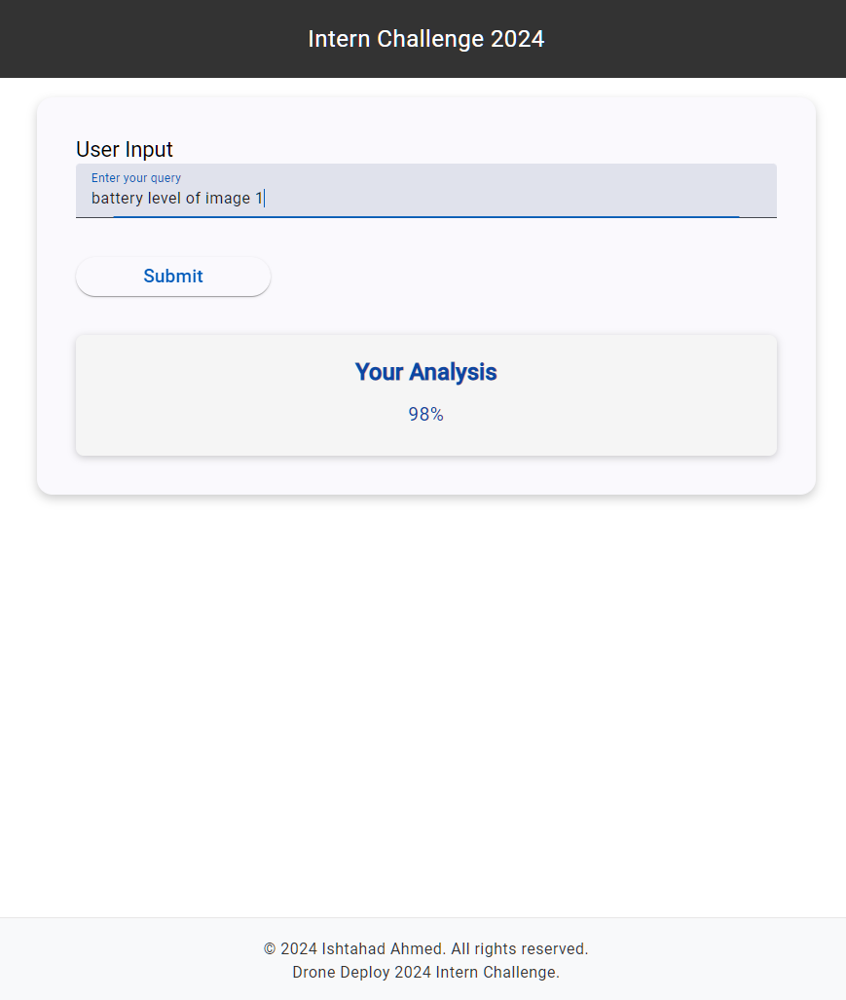
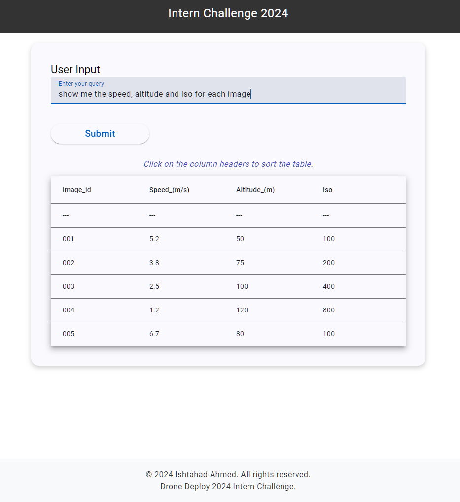

```markdown
# Drone Query Application

This repository contains the Drone Query application, which utilizes Angular for the frontend and FastAPI for the backend. The system allows users to submit queries and retrieve structured data or percentage-based responses based on drone image metadata, processed by the Gemini AI model.

## Output Screenshots

#### 1. Basic Analysis Display


#### 2. Table Display for Data


## Known Bugs and Issues

### 1. Inconsistent Data Rendering
In some cases, the format of the response data can lead to incorrect rendering as a table, even when a simple card display would be more appropriate. This issue is particularly evident when the API returns a structured JSON response that includes both a `"response"` field and a `"data"` array, which is not suited for tabular display.

### 2. Missing Metric in Responses
In some cases, the unit or metric (e.g., `%` or `m`) disappears from the response, displaying values like `75` instead of `75%` or `82` instead of `82m`. This bug is caused by an issue in the conditional logic within the user input component and template.

### 3. Karma/Jasmine Environment Bug
Karma/Jasmine tests fail to load and execute properly in the browser due to an environment-related issue, preventing test runs from completing successfully.

---

## Prerequisites

Before you begin, ensure you have the following installed on your machine:

- [Angular CLI](https://angular.io/cli) (install via npm)
- [Python](https://www.python.org/downloads/) (version 3.7 or later)
- [FastAPI](https://fastapi.tiangolo.com/) (can be installed via pip)
- [PostgreSQL](https://www.postgresql.org/download/) or any other database you wish to use (optional, based on your application needs)

To install Angular CLI globally, run:

```bash
npm install -g @angular/cli
```

## Installation

### Frontend Installation

1. **Clone the Repository:**

   Clone this repository to your local machine:

   ```bash
   git clone https://github.com/IshsGit/DroneDeploy.git
   cd drone-query/frontend
   ```

2. **Install Frontend Dependencies:**

   Run the following command to install the required packages:

   ```bash
   npm install
   ```

### Backend Installation

1. **Navigate to the Backend Directory:**

   ```bash
   cd ../backend
   ```

2. **Create a Virtual Environment:**

   Create and activate a Python virtual environment:

   ```bash
   python -m venv venv
   source venv/bin/activate  # On Windows use `venv\Scripts\activate`
   ```

3. **Install Backend Dependencies:**

   Install the required Python packages:

   ```bash
   pip install -r requirements.txt
   ```

4. **Create Environment Variables:**

   Create a `.env` file in the backend directory and add your API keys and other configuration variables:

   ```bash
   touch .env
   ```

   Add the following to your `.env` file (replace with actual values):

   ```plaintext
   GEMINI_API_KEY=your_api_key_here
   DATABASE_URL=your_database_url_here
   ```

## Running the Application

### Start the Backend

1. **Run the FastAPI server:**

   In the backend directory, start the FastAPI server:

   ```bash
   fastapi dev main.py
   ```

   The server will run at `http://localhost:8000`.

### Start the Frontend

1. **Run the Angular application:**

   In the frontend directory, start the Angular application:

   ```bash
   ng serve
   ```

   The application will be available at `http://localhost:4200`.

## Usage

- Open your browser and navigate to `http://localhost:4200`.
- Enter your query in the input field and press "Submit" or hit "Enter".
- The response will be displayed below the input, either in the form of structured data (tabular format) or a percentage-based response.

## Notable Code Snippets

### Frontend (Angular) - `UserInputComponent`

The `UserInputComponent` in Angular is the main interface for users to input their queries. It sends the user query to the backend and processes the response.

```typescript
import { Component, ViewChild, AfterViewInit } from '@angular/core';
import { MatTableDataSource } from '@angular/material/table';
import { MatSort } from '@angular/material/sort';
import { HttpClient } from '@angular/common/http';

@Component({
  selector: 'app-user-input',
  templateUrl: './user-input.component.html',
  styleUrls: ['./user-input.component.scss'],
})
export class UserInputComponent implements AfterViewInit {
  userInput: string = '';
  dataSource = new MatTableDataSource<ImageData>([]);
  displayedColumns: string[] = [];
  percentageResponse: string | null = null;
  directResponse: string | null = null;
  isLoading: boolean = false;

  @ViewChild(MatSort) sort!: MatSort;

  constructor(private http: HttpClient) {}

  ngAfterViewInit() {
    this.dataSource.sort = this.sort;
  }

  submitQuery() {
    const apiUrl = 'http://localhost:8000/process-query/';
    this.isLoading = true;
    this.http.post<{ response: { response: string; data: ImageData[]; percentage?: string } }>(apiUrl, { query: this.userInput })
      .subscribe({
        next: (response) => {
          this.percentageResponse = response.response.percentage || null;
          this.directResponse = response.response.response || null;
          this.dataSource.data = response.response.data || [];
          this.displayedColumns = Object.keys(response.response.data[0] || {});
          this.isLoading = false;
        },
        error: (error) => {
          console.error('Error:', error);
          this.isLoading = false;
        }
      });
  }
}
```

### Backend (FastAPI) - Gemini Query Handler

The backend processes user queries using the Gemini API, which utilizes AI to analyze the dataset and return either percentage-based or structured table responses.

```python
import os
import logging
from dotenv import load_dotenv
import google.generativeai as genai
from data.dataset import load_dataset

load_dotenv()

# Configure the Gemini API
GEMINI_API_KEY = os.getenv("GEMINI_API_KEY")
genai.configure(api_key=GEMINI_API_KEY)

def process_query(query: str, dataset_path: str) -> dict:
    logging.info(f"Processing query: {query}")
    dataset = load_dataset(dataset_path)

    safety_settings = [{"category": "HARM_CATEGORY_HATE_SPEECH", "threshold": "BLOCK_NONE"}]

    model = genai.GenerativeModel("gemini-pro")
    chat = model.start_chat(history=[])

    full_prompt = f"{query}\n{dataset}"

    try:
        response = chat.send_message(full_prompt, safety_settings=safety_settings)
        return process_response(response.text.strip())
    except Exception as e:
        logging.error(f"Error: {e}")
        return {"response": "An error occurred.", "data": None}

def process_response(response_text: str) -> dict:
    structured_response = {'response': response_text, 'data': []}
    if '%' in response_text:
        structured_response['percentage'] = response_text
    else:
        lines = response_text.splitlines()
        if len(lines) > 1:
            headers = [header.strip() for header in lines[0].split('|')]
            for line in lines[1:]:
                values = [value.strip() for value in line.split('|')]
                if len(values) == len(headers):
                    row_data = {headers[i]: values[i] for i in range(len(headers))}
                    structured_response['data'].append(row_data)
    return structured_response
```

### CORS and FastAPI Setup

FastAPI is set up with CORS middleware to allow requests from the frontend hosted on `localhost:4200`.

```python
from fastapi import FastAPI
from fastapi.middleware.cors import CORSMiddleware
from pydantic import BaseModel
from gemini_handler import process_query

app = FastAPI()

# CORS configuration
origins = ["http://localhost:4200"]

app.add_middleware(
    CORSMiddleware,
    allow_origins=origins,
    allow_credentials=True,
    allow_methods=["*"],
    allow_headers=["*"],
)

class UserQuery(BaseModel):
    query: str

@app.post("/process-query/")
async def handle_query(user_query: UserQuery):
    dataset_path = "data/dataset.json"
    response = process_query(user_query.query, dataset_path)
    return {"response": response}
```

### Dataset Loader

This simple utility loads the dataset used by the Gemini API from a JSON file.

```python
import json

def load_dataset(file_path: str):
    with open(file_path, "r", encoding="utf-8") as f:
        return json.load(f)
```

## Testing

### Frontend Testing

To test the Angular application, you can run:

```bash
ng test
```

### Backend Testing

For testing the FastAPI backend, you can use `pytest`. First, ensure you're in the backend virtual environment, then run:

```bash
pytest
```

## Conclusion

This application demonstrates the integration of an Angular frontend with a FastAPI backend powered by the Gemini API for querying and processing drone metadata. You can customize and

 expand upon this base to build a more sophisticated drone data query system.
```